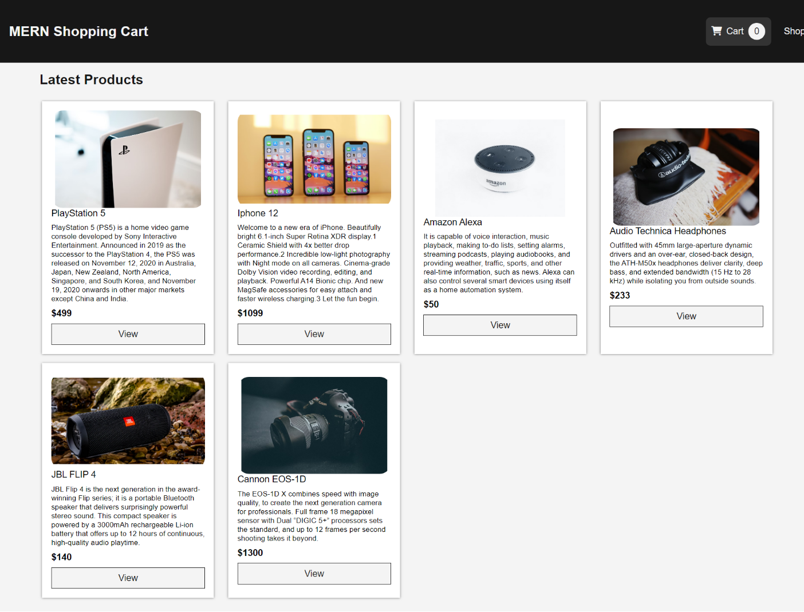

# Online Shopping

This application is a tool for searching for and purchasing goods and services over the Internet through the use of a web browser.

## Table of Contents

- [Introduction](#Introduction)
- [Libraries and Technologies Used](#Libraries)
- [Screenshot](#Screenshot)
- [Link](#Link)

## Introduction

- This application is a tool for searching for and purchasing goods and services over the Internet through the use of a web browser.
- The customer can select the item he/she is interested and can also select the number of quantity.
- After selection add in to the cart.

## Libraries

- node js
- Visual Studio Code 1.51.1
- express
- MongoDB
- React

## Screenshot

## Link

- Link: https://onlineshopapp-mern.herokuapp.com/
